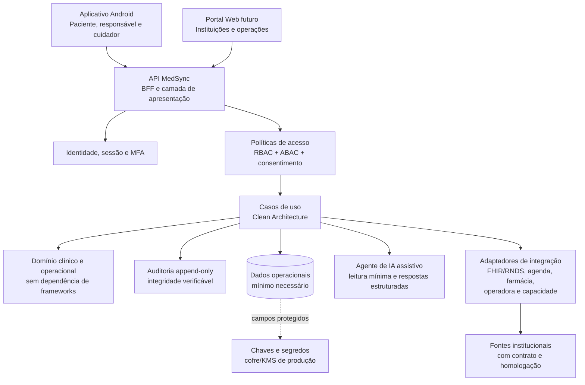

# Arquitetura de Referência — MedSync

## Decisão executiva

O MedSync deve começar como um **monólito modular**, com aplicativo Android Expo e uma API TypeScript protegida, em vez de microserviços. Essa decisão reduz superfície operacional, custo de observabilidade e inconsistências de transação na fase em que o produto ainda valida fluxos clínicos e institucionais. A evolução para serviços separados só ocorrerá quando um limite real for comprovado — por exemplo, uma integração certificada que exija isolamento próprio, processamento assíncrono regulado ou uma carga sustentada incompatível com o módulo principal.

Dados de saúde são pessoais sensíveis. O art. 11 da LGPD restringe seu tratamento e compartilhamento a hipóteses específicas; a norma também veda o uso de dados de saúde por operadoras para seleção de risco. [1] Por isso, o sistema não terá monetização de dados de saúde, perfilamento publicitário, compartilhamento amplo entre instituições ou treinamento de modelos com prontuários como comportamento padrão.

> **Princípio clínico:** o agente de IA organiza dados autorizados e sinaliza regras não diagnósticas. Ele não diagnostica, faz triagem, prescreve, altera dose, comunica prognóstico, escolhe hospital ou decide encaminhamentos. A supervisão humana e a decisão médica final são obrigatórias quando a IA tiver uso relevante no cuidado. [2]

## Recorte e limites do MVP

O primeiro lançamento concentra-se em paciente, responsável legal e cuidador: histórico informado ou importado de fonte aprovada, agenda, solicitação de reagendamento, rotina de medicamentos, delegação de acesso e alertas explicáveis. O sistema deve armazenar a origem e a data de cada informação. Um item sem origem confiável será exibido como informação declarada pelo usuário, e não como dado clínico validado.

Recursos de hospitais, SAMU, operadoras e farmácias serão construídos como **módulos de integração progressiva**. Até existir contrato, credenciamento, fonte operacional, homologação e regra de atualização, o produto não informará lotação hospitalar, cobertura, disponibilidade, preço, autenticidade de receita ou melhor destino de emergência como fatos. A RNDS deve ser tratada como uma integração institucional, mediada por estabelecimento e integrador, com os modelos e processos publicados pelo Ministério da Saúde. [3]

| Capacidade | Situação no MVP | Condição para produção com dados reais |
|---|---|---|
| Linha do tempo e medicamentos | Implementada com dados de demonstração ou registros de origem identificada | Autenticação, consentimento, auditoria e política de retenção aprovadas |
| Cuidador e lembretes | Implementada com concessão limitada por escopo e tempo | Consentimento ativo, confirmação de vínculo e notificações protegidas |
| Reagendamento | Solicitação rastreável, sem confirmação automática | Conector homologado ou confirmação explícita do estabelecimento |
| Farmácia e receitas | Preparação de contrato de integração | Integração autorizada, validação farmacêutica e análise regulatória |
| Hospital/SAMU | Fora do MVP assistencial | Dados operacionais validados, governança pública e decisão humana de regulação |
| Cobertura de plano | Fora do MVP | Fonte oficial/contratual da operadora e regras de elegibilidade auditáveis |

## Arquitetura lógica



O aplicativo não consulta bancos de dados nem parceiros diretamente. Ele se comunica com procedimentos autenticados, versionados e validados no servidor. A camada de apresentação adapta protocolos e entradas; os casos de uso orquestram regras; o domínio contém entidades, políticas e invariantes; a infraestrutura implementa persistência, notificações e adaptadores externos. Dependências apontam sempre para dentro.

```text
server/
  modules/
    identity/          domain | application | infrastructure | presentation
    consent/           domain | application | infrastructure | presentation
    health-records/    domain | application | infrastructure | presentation
    medication/        domain | application | infrastructure | presentation
    care-circle/       domain | application | infrastructure | presentation
    appointments/      domain | application | infrastructure | presentation
    alerts/             domain | application | infrastructure | presentation
    audit/              domain | application | infrastructure | presentation
    integrations/       domain | application | infrastructure | presentation
  db.ts                composição de persistência, sem regra clínica
  routers.ts            registro de adaptadores de apresentação
shared/
  access-policy.ts      regra pura e testável de autorização
  health-domain.ts      contratos tipados sem detalhes de infraestrutura
app/
  (tabs)/               telas, interação e estados de visualização
tests/
  *.test.ts             testes unitários, regressivos e de contrato
```

## Bounded contexts e dados

| Contexto | Entidades principais | Invariantes essenciais |
|---|---|---|
| Identidade | `Account`, `PersonProfile`, `DeviceSession`, `OrganizationMembership` | Contas não são compartilhadas; cada sessão e dispositivo tem identidade rastreável; associação institucional é aprovada e revogável. |
| Consentimento | `ConsentGrant`, `Purpose`, `Scope`, `Revocation` | Todo acesso de terceiro exige finalidade, escopo, prazo e titular/responsável definidos; revogação tem efeito prospectivo imediato. |
| Registros de saúde | `ClinicalRecord`, `SourceReference`, `Document`, `Provenance` | Nenhuma alteração elimina a proveniência; conteúdo clínico não é sobrescrito silenciosamente; dados de teste nunca se misturam a produção. |
| Medicamentos | `MedicationPlan`, `MedicationSchedule`, `IntakeLog`, `PrescriptionReference` | Confirmação de tomada é um registro, não uma alteração de prescrição; alertas não instruem nova dose; dispensação é responsabilidade farmacêutica. |
| Rede de cuidado | `CareCircle`, `CaregiverGrant`, `EmergencyContact` | Cuidador recebe somente os escopos consentidos, pelo prazo autorizado e com histórico de consulta. |
| Agenda | `Appointment`, `RescheduleRequest`, `AvailabilitySource` | Uma solicitação não equivale a agendamento confirmado; a origem e a atualização da disponibilidade devem aparecer ao usuário. |
| Alertas | `AlertRule`, `AlertEvidence`, `HealthAlert`, `Acknowledgement` | Todo alerta apresenta fonte, data, motivo e orientação segura; regras clínicas só entram após revisão e versionamento. |
| Auditoria | `AuditEvent`, `AccessEvent`, `ConsentEvent`, `SecurityIncident` | Eventos são somente de inclusão; o ator, alvo, finalidade, resultado e identificador de correlação são obrigatórios. |
| Integrações | `PartnerConnection`, `ExternalIdentifier`, `SyncJob`, `FHIRMapping` | Sistemas externos ficam atrás de adaptadores; tokens não aparecem em logs; cada registro mantém identificador do emissor. |

Identificadores externos devem usar a tupla **emissor + tipo + valor**, com índice único, e não um CPF exposto como chave técnica. Para novos identificadores de domínio, usar identificadores aleatórios não sequenciais, com correlação interna separada da identidade exibida ao usuário. Requests mutáveis devem exigir `idempotencyKey` por ator e rota, evitando registros duplicados em redes instáveis.

## Autorização, privacidade e auditoria

A autorização combina papéis com atributos. O papel define a categoria geral — paciente, cuidador, profissional ou farmácia — e os atributos restringem organização, paciente, escopo, finalidade, vigência, estado de consentimento e relação ativa. Não existirá uma permissão genérica “ver prontuário”. O servidor avaliará a solicitação em cada acesso e produzirá um evento de auditoria antes da resposta.

| Controle | Decisão de arquitetura | Teste obrigatório |
|---|---|---|
| Identidade única | Proibir credenciais compartilhadas; sessão por dispositivo; MFA ou reforço de identidade para operações de alto impacto | Acesso de cuidador e profissional falha sem concessão ativa e verificável |
| Menor privilégio | RBAC para o tipo de usuário e ABAC para escopo, finalidade e organização | Escopo de medicamento não concede acesso a documentos clínicos |
| Consentimento | Concessão explícita, versão de termo, prazo, revogação, origem e trilha | Revogação impede nova leitura imediatamente e fica auditada |
| Criptografia | TLS em trânsito; criptografia de campos clínicos sensíveis antes da persistência com envelope de chave; rotação e segregação de chaves no ambiente produtivo | Dados protegidos não podem ser lidos sem serviço autorizado e contexto válido |
| Auditoria | Log append-only com hash encadeado, correlação, retenção e exportação controlada | A sequência é verificável e eventos não podem ser editados pelo aplicativo |
| Incidentes | Runbook de deteção, contenção, avaliação, evidências e comunicação | Exercício de incidente comprova tempo, responsáveis e decisões registradas |
| Dados de IA | Minimização de contexto, pseudonimização quando possível, sem uso para treino por padrão | Prompt não inclui campos além da finalidade e cada execução gera evento de auditoria |

A Resolução CD/ANPD nº 15/2024 está listada pela ANPD como regulamento de comunicação de incidente de segurança. [4] Antes de dados reais, o projeto precisa de encarregado de dados, inventário de tratamento, DPIA/RIPD quando aplicável, planos de resposta, revisão jurídica e acordos com os controladores e operadores envolvidos.

> **Limitação operacional registrada:** o banco gerenciado atual é compatível com TiDB e não aceita gatilhos `UPDATE`/`DELETE` para tornar uma tabela fisicamente imutável. Enquanto essa limitação existir, o MedSync restringe a auditoria a um caminho de inserção no servidor, não expõe operações de alteração/exclusão, encadeia hashes e verifica a sequência. Antes de produção com dados reais, a infraestrutura deverá impor imutabilidade também por permissões de banco/armazenamento WORM ou serviço de auditoria dedicado.

## Interoperabilidade e integrações

O núcleo do MedSync usará modelos próprios de domínio e exporá adaptadores para FHIR, impedindo que versões ou extensões externas contaminem regras internas. A RNDS informa que sua integração orienta gestores de estabelecimentos e integradores de software por modelos informacionais e computacionais. [3] Cada adaptador deverá transformar, validar, registrar proveniência, garantir idempotência e deixar a origem visível.

Antes de qualquer ingestão, o adaptador deve validar o contrato `medsync.clinical-import.v1`: versão explícita, emissor homologado, referência externa do paciente e do evento, categoria permitida, datas válidas e proveniência de sistema clínico ou parceiro verificado. O contrato é uma fronteira de validação; ele não autoriza uma conexão de rede, que continuará condicionada a autenticação institucional, consentimento aplicável e homologação.

| Integração | Interface interna | Regra de proteção |
|---|---|---|
| RNDS/FHIR | `ClinicalRecordGateway` e `FHIRMapper` | Não conectar sem processo institucional e ambiente homologado; validar perfis e proveniência. |
| Clínicas e hospitais | `AppointmentGateway` e `FacilityDirectoryGateway` | Disponibilidade não é presumida; toda sincronização guarda data/hora e fonte. |
| Farmácias | `MedicationAvailabilityGateway` e `PrescriptionVerificationGateway` | Preço/estoque são informativos, com atualização; validação e dispensação continuam com farmacêutico. |
| Operadoras | `CoverageGateway` | Respostas devem mostrar origem e não podem abastecer seleção de risco. |
| Operações de emergência | `CapacitySignalGateway` | Fora do MVP; requer fonte oficial, SLA, governança de qualidade e decisão humana de regulação. |

## Agente de IA assistivo

O agente recebe somente uma visão mínima e estruturada, como cronologia autorizada, medicações registradas, alergias documentadas e alertas já aprovados. Ele retorna um contrato fechado: `resumo`, `itens_para_revisar`, `evidencias`, `limites` e `orientacao_segura`. A camada de aplicação valida cada campo, remove qualquer orientação diagnóstica ou de dose e associa a resposta a uma regra ou registro de origem.

“Aprender alertas” não significa treinar continuamente com os prontuários. No MVP, significa personalizar a ordem de alertas a partir de preferências e dados autorizados, com regras versionadas e revisadas. Qualquer modelo que passe a fazer inferência clínica, priorização de risco ou apoio relevante à decisão deve receber classificação de risco, avaliação regulatória e clínica, governança, monitoramento de desempenho e supervisão humana. A orientação do CFM destaca classificação de risco, governança, auditoria, transparência e a permanência da decisão médica com o profissional. [2] A Anvisa mantém orientação específica sobre software como dispositivo médico, portanto alegações clínicas futuras exigem avaliação de enquadramento antes da liberação. [5]

## Estratégia de qualidade e operação

O produto seguirá TDD nos módulos de domínio e de aplicação: primeiro um teste que expressa a regra, depois a menor implementação para satisfazê-lo, por fim refatoração. Testes unitários cobrem políticas, transições e calculadoras; testes de integração cobrem repositórios e auditoria; testes de contrato cobrem adaptadores FHIR e parceiros; testes de regressão reproduzem incidentes corrigidos. Funcionalidades de saúde não serão liberadas apenas por cobertura numérica: requerem revisão de cenário clínico, privacidade, segurança e acessibilidade.

Ambientes de desenvolvimento e homologação usam dados sintéticos. Produção exige segregação de ambientes, controle de mudanças, logs estruturados sem conteúdo clínico, backup criptografado testado, observabilidade com identificadores de correlação e plano de recuperação. O agente deve ter limites de taxa, budget, telemetria e mecanismo de desligamento independente do restante da plataforma.

## Referências

[1] [Lei nº 13.709/2018 — LGPD, art. 11](http://www.planalto.gov.br/ccivil_03/_ato2015-2018/2018/lei/L13709compilado.htm)

[2] [Conselho Federal de Medicina — CFM normatiza uso da IA na medicina](https://portal.cfm.org.br/noticias/cfm-normatiza-uso-da-ia-na-medicina/)

[3] [Ministério da Saúde — Guia da Rede Nacional de Dados em Saúde](https://rnds-guia.saude.gov.br/)

[4] [ANPD — Regulamentações, Resolução CD/ANPD nº 15/2024](https://www.gov.br/anpd/pt-br/acesso-a-informacao/institucional/atos-normativos/regulamentacoes_anpd)

[5] [Anvisa — Software como dispositivo médico: perguntas e respostas](https://www.gov.br/anvisa/pt-br/assuntos/noticias-anvisa/2022/software-como-dispositivo-medico-perguntas-e-respostas)
