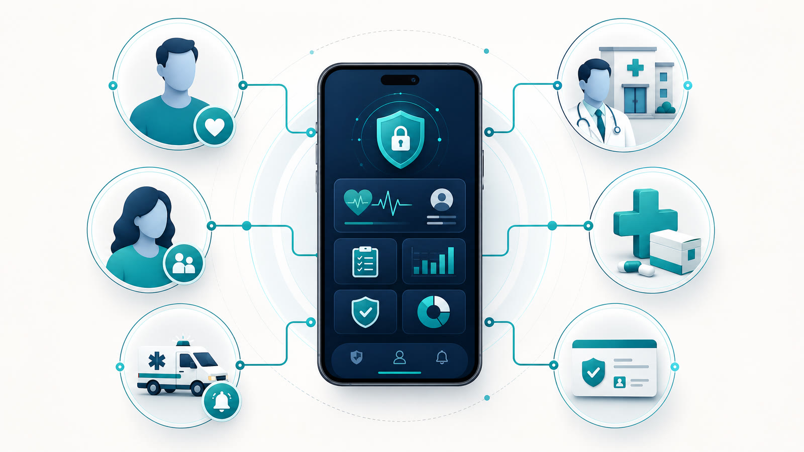
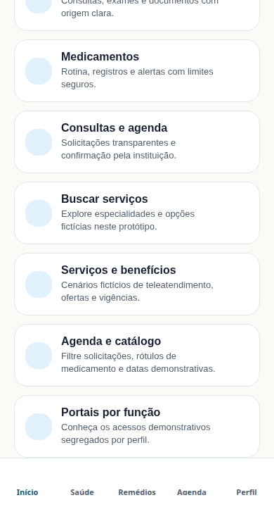

# MedSync — Technical Portfolio Dossier

> **Positioning:** an integrated health-platform prototype built for cross-platform demonstration. This repository documents product, architecture, and quality decisions; it is not a medical-care service and does not process real patient data.



## Executive summary

**MedSync** is a digital health platform designed to connect patients, legal representatives, and caregivers to authorized health information, appointments, medication routines, explainable alerts, and emergency contingency. Its core shares business rules across **Android, iOS, and Web**, using Expo/React Native on the client, a TypeScript/tRPC API, and MySQL with Drizzle ORM for persistence.

The engineering challenge was not merely assembling screens. The project aimed to build a demonstrable foundation that treats health information as sensitive data, makes the AI boundary explicit, and prevents uncontracted scenarios from being displayed as facts. The outcome is a functional, documented, and automatically validated prototype designed to evolve through institutional integrations once they are properly approved.

| Dimension | Portfolio deliverable |
|---|---|
| Product | Demonstration journeys for patients, legal representatives, caregivers, and segregated institutional profiles. |
| Engineering | Pragmatic Clean Architecture, typed contracts, tRPC, MySQL/Drizzle, and local Docker. |
| Privacy | Revocable consent, least privilege, AES-256-GCM encryption, and chained audit events. |
| Clinical safety | Restricted assistive AI with no diagnosis, triage, dosage, prescription, or autonomous decision. |
| Quality | 105 regression tests, TypeScript checking, linting, Cypress Web tests, and operational evidence. |

## Problem and proposed approach

People receiving continuous care often need to organize appointments, documents, medicines, and communication with their care network. At the same time, clinics, pharmacies, insurers, and regulators depend on trusted data, provenance, authorization, and institutional workflows. A platform that ignores those boundaries can expose sensitive data, imply unsafe clinical guidance, or promise integrations that do not exist.

MedSync addresses this through an intentionally gradual approach. In the demonstration environment, all journeys use synthetic data and are visibly labelled as such. Capabilities that depend on hospitals, pharmacies, providers, insurers, Brazil’s National Health Data Network, or regulation are rendered as blocked demonstration modules rather than real-world actions. This design keeps risk low and the product backlog technically honest.

## Product experience

The prototype provides responsive navigation for compact mobile screens and the Web. It includes a health timeline, synthetic documents, medication plans, intake logging, appointments, rescheduling requests, care contacts, audit visibility, and an AI transparency center.



| Journey | What the demonstration proves | Applied safeguard |
|---|---|---|
| Profile and privacy | Preferences, contacts, and data-use transparency. | Protected session, relationship, and purpose-of-access checks. |
| Timeline and assets | Strictly synthetic records, images, and documents. | Provenance, demonstration label, and protected fields. |
| Medication | Plans, reminders, and intake logging. | Does not calculate doses or replace professional advice. |
| Scheduling | Source-identified appointments and traceable rescheduling. | A request is not a confirmation; live integrations remain blocked. |
| Assistive AI | Structured summary, evidence, limits, and shutdown. | No triage, diagnosis, prescription, or referral decision. |
| Emergency | Deterministic access to SAMU 192 and authorized contacts. | Independent of AI, credits, models, or connectivity. |

## Architecture and technical decisions


The project uses a **modular monolith** deliberately. Rather than prematurely adopting microservices, it keeps application modules around stable contracts, lowering operational overhead and transactional inconsistency while external integrations remain demonstrative. Boundaries are preserved between presentation adapters, use cases, domain policies, and infrastructure.

```text
Expo / React Native (Android · iOS · Web)
                  │
              tRPC / Express
                  │
        Use cases and domain policies
                  │
     Drizzle ORM / MySQL / chained audit trail
                  │
 Future adapters: RNDS/FHIR, scheduling, pharmacy, insurer
```

| Decision | Rationale | Repository evidence |
|---|---|---|
| Expo + React Native | A single UI core for Android, iOS, and Web. | `app/`, `app.config.ts`, and mobile parity contracts. |
| End-to-end TypeScript | Reduce drift between routes, data, and screens. | `shared/`, `server/`, and `pnpm check`. |
| tRPC + Express | Typed contracts without duplicated transport DTOs. | `server/routers.ts` and `lib/trpc.ts`. |
| MySQL + Drizzle | Versioned migrations and typed persistence. | `drizzle/schema.ts` and `drizzle/`. |
| Pragmatic Clean Architecture | Keep health and authorization rules isolated from frameworks. | `ARCHITECTURE.md`, `shared/`, and policy tests. |
| Local Docker | Reproduce database, API, and Web validation. | `docker/compose.yaml` and operations report. |

## Security, privacy, and clinical boundaries

Health data is sensitive personal data. The prototype therefore applies role- and attribute-based authorization, time- and scope-bound grants, consent revocation, non-sequential identifiers, append-only chained auditing, and AES-256-GCM encryption for sensitive fields. The application does not place free-form clinical content in audit logs and makes demonstration data explicit to prevent it from being confused with real records.

> **Clinical-safety principle:** the AI organizes authorized context and returns structured information for review. It does not diagnose, triage, prescribe, change dosage, select a hospital, or autonomously contact emergency services.


| Control | Prototype implementation | Requirement for real-world use |
|---|---|---|
| Identity and session | OAuth, protected session, and recoverable logout. | Strong identity policy and device management. |
| Consent | Scope, purpose, expiry, and auditable revocation. | Legal review, approved terms, and operational governance. |
| Encryption | AES-256-GCM for sensitive fields at rest. | KMS/key vault, rotation, and environment segregation. |
| Auditing | Chained events with actor, target, purpose, and correlation. | Infrastructure/WORM immutability and approved retention. |
| AI | Versioned rules, human review, transparency, and shutdown. | Clinical/regulatory assessment and ongoing monitoring. |
| Emergency | Local SAMU 192 and authorized-contact flow. | Official integration only with governance and human decision. |

The design reflects the special nature of health data under Brazil’s LGPD and preserves human medical decision-making for relevant AI use. The National Health Data Network is modeled as an institutional boundary rather than a simple technical request. [1] [2] [3]

## Quality, tests, and execution proof

The project was developed with domain, contract, and regression tests. Alongside static validation and linting, the Web has a Cypress suite that exports the app statically and tests an isolated instance. This prevents the automation browser from competing with the Expo/Metro interactive preview during execution.

| Validation | Documented result | How to reproduce |
|---|---:|---|
| Domain regression | 43 files / 105 passing tests | `pnpm test` |
| Type checking | Passed without errors | `pnpm check` |
| Linting | Passed | `pnpm lint` |
| Web E2E | 4 Cypress scenarios passed | `pnpm test:e2e` |
| Web export | Static routes generated | `pnpm exec expo export --platform web` |
| Local Docker | MySQL, API, and Web passed on Windows | `docker compose -f docker/compose.yaml up --build` |


These artifacts are not presented as a production certification. The validation report explicitly separates what was tested from what still requires physical devices, partner approval, legal analysis, clinical validation, and institutional data sources. See the [execution evidence](evidence/EXECUTION_EVIDENCE.md), [`VALIDATION_REPORT.md`](../VALIDATION_REPORT.md), [`CYPRESS.md`](../CYPRESS.md), and the [prototype execution matrix](../PROTOTYPE_EXECUTION_MATRIX.md).

## Operations and local reproduction

```bash
# Development
pnpm install
pnpm dev

# Quality
pnpm test
pnpm check
pnpm lint
pnpm test:e2e

# Local Docker — configure fresh secrets in .env first
docker compose -f docker/compose.yaml up --build
```

In the demonstration Docker Desktop run, the composition was validated with MySQL on its private segment, the API at `http://localhost:3001/api/health`, and the Web interface at `http://localhost:8081`. The build context excludes `.env`, logs, artifacts, and local dependencies to prevent secrets and host-specific binaries from entering the Linux image.

## Scope, maturity, and honest next steps

MedSync is an engineering and product demonstration. It implements internal journeys that can exist without live partners, but it does not claim real provider availability, medication stock or pricing, coverage status, prescription authenticity, bed capacity, or emergency routing. Production use with real data requires approved integrations, contracts, security and privacy review, incident response operations, device testing, and appropriate clinical and regulatory validation.

For a professional portfolio, this repository demonstrates the ability to translate a high-responsibility domain into a traceable product: explicit requirements, architectural decisions, clear boundaries, automated tests, operational documentation, and an evolution strategy that does not misrepresent a prototype as a clinical service.

## Visual evidence index

| Artifact | Purpose |
|---|---|
| `assets/optimized/medsync-ecosystem-infographic.jpg` | Integrated view of product participants and modules. |
| `assets/optimized/medsync-architecture-infographic.jpg` | Layers, data flow, and integration boundaries. |
| `assets/optimized/medsync-safety-infographic.jpg` | Privacy, auditing, assistive AI, and contingency. |
| `evidence/cypress/medsync-web.cy.ts/web-home-mobile.png` | Home interface in a mobile viewport, captured in Cypress. |
| `evidence/cypress/medsync-web.cy.ts/web-care-explorer-desktop.png` | Demonstration explorer in desktop, captured in Cypress. |
| [`evidence/EXECUTION_EVIDENCE.md`](evidence/EXECUTION_EVIDENCE.md) | Reproducible commands and execution outcomes. |
| [`assets/optimized/medsync-presentation-preview.mp4`](assets/optimized/medsync-presentation-preview.mp4) | Versionable presentation-video preview; the 1280 × 720 original is preserved in the project files. |

## References

[1] [Brazilian Law No. 13,709/2018 — General Data Protection Law](https://www.planalto.gov.br/ccivil_03/_ato2015-2018/2018/lei/l13709.htm)

[2] [Brazilian Federal Council of Medicine — AI use in medicine](https://portal.cfm.org.br/noticias/cfm-normatiza-uso-da-ia-na-medicina/)

[3] [Brazilian Ministry of Health — National Health Data Network](https://rnds.saude.gov.br/)
